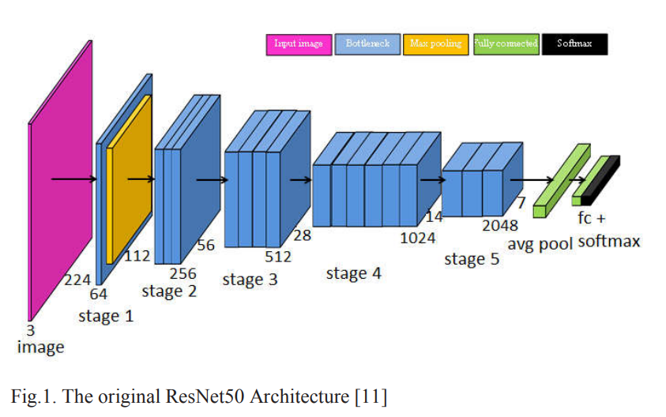
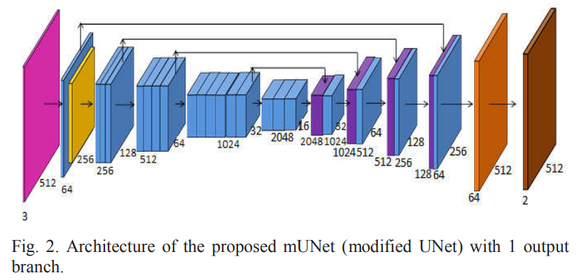
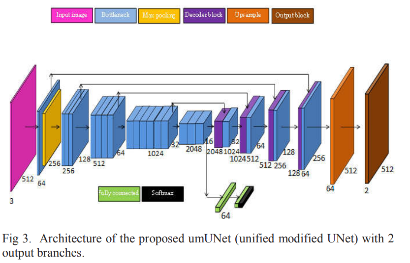

# Image_Fake_Segmentation_Model
## Architecture
We implement three models, including: Classification (ResNet50), Segmentation (modified UNet) and Unification (unified modified UNet).
+ ResNet50 is chosen for the classification task. The ResNet50 architecture is shown in Figure 1.
+ Segmentation network is plotted in Figure 2.
+ A proposed model that merges the two models above into a single model called umUNet (unified modified UNet). umUNet is depicted in Figure 3.

<p align="center">
  
  
  
</p>


## Result


Compare the predictions of two models: mUNet and umUNet. Each column is a data sample, while the rows represent the input image, surface label, mUNet surface prediction and umUNet surface prediction, respectively. As we can see, the segmented umUNet regions are sharper than those of mUNet.

## Citation
```
@article{
  title={Modified CNN model-based Forgery Detection applied to Multiple-Resolution Tampered Images},
  author={Thuong Le-Tien, Duy Ho-Van, Nhu Pham-Ng-Quynh, Hanh Phan-Xuan and Tuan Nguyen-Thanh},
  journal={NAFOSTED Conference on Information and Computer Science (NICS)},
  year={2021}
}
```
